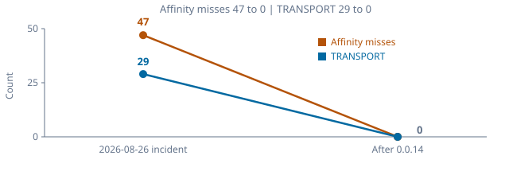

# dsh-plugin-oauth-subs

简体中文 | [English](README.md)

[](https://github.com/xxww0098/dsh-plugin-oauth-subs/actions/workflows/ci.yml)

把 **ChatGPT / Codex**、**xAI Grok**、**智谱 GLM**、**AWS Kiro**、**Google Antigravity**、**Cursor**、**Ollama Cloud**、**Kimi Code Plan** 和 **OpenCode Free** 接到 [DeepSeek Harness](https://github.com/deepseek-ai/deepseek-harness)。登录走官方 OAuth；Kiro 还可贴 `ksk_` API key；Cursor 可复用本机 CLI / IDE 登录；Ollama 贴 ollama.com API key（Cloud，不是本机 11434）；Kimi 走设备码 / `kimi-code.json`；OpenCode Free 一键匿名启用。本机代理 + `llm-pi-ai` 路由同步；每家从闭集 `openai-responses` | `openai-completions` | `anthropic-messages` 里选一种 DSH `api`。

## 安装

```sh
dsh plugin --profile web add https://github.com/xxww0098/dsh-plugin-oauth-subs
dsh web
```

打开 **设置 → OAuth 订阅**。每个账号一张卡片（额度都在卡片上；Ollama Cloud 没有额度条）。关于页 **当前版本** 每次重读本进程加载的 `package.json`（不冻结模块加载时的值）。wrapper / `~/.dsh.pid` 没杀掉的旧 `dsh web` 会继续报旧版本，先 `pgrep -lf 'dsh web'`。profile `node_modules` 更新时另列 **磁盘**，即使该文件已是 latest 也可能再 `add …#<tag>`。或 `pnpm dsh web --patch ./cordis.patch.yml`（`id: oauth-subs`）。

## 系列

| 提供商 | 登录 | DSH api | 上游 hop |
|---|---|---|---|
| ChatGPT Codex | PKCE `localhost:1455`（占用则 `1457`）；可粘贴回调；`app_EMoamEEZ73f0CkXaXp7hrann` | `openai-responses` | `chatgpt.com/backend-api/codex/responses` |
| xAI Grok | 设备码（默认）；PKCE `127.0.0.1:56121`；`b1a00492-073a-47ea-816f-4c329264a828` | `openai-responses` | `api.x.ai/v1/responses` |
| GLM · Z.ai（全球） | ZCode CLI 轮询 `provider: zai`；再换发 `id.secret`；`client_P8X5CMWmlaRO9gyO-KSqtg` | `anthropic-messages` | `api.z.ai/api/anthropic`（Completions 残留 `…/coding/paas/v4`） |
| GLM · BigModel（中国） | 同一 CLI 轮询，`provider: bigmodel`；poll JWT 即密钥；client `zcode` | `anthropic-messages` | `open.bigmodel.cn/api/anthropic`（Completions 残留 `…/coding/paas/v4`） |
| AWS Kiro | Social PKCE `app.kiro.dev`（3128…53153）/ Builder ID / IdC / Entra / `ksk_` | `openai-completions` | `q.<region>.amazonaws.com` `GenerateAssistantResponse` |
| Google Antigravity | Google OAuth `localhost:51121`；可粘贴回调；`1071006060591-…apps.googleusercontent.com` | `openai-completions` | `daily-cloudcode-pa.googleapis.com/v1internal:streamGenerateContent` |
| Cursor | PKCE 轮询 `cursor.com/loginDeepControl`；或 **导入本机 Cursor** | `openai-completions` | Connect `agentn.us.api5.cursor.sh` `AgentService/Run` |
| Ollama Cloud | 粘贴 API key / 导入 `OLLAMA_API_KEY` | `openai-completions` | `https://ollama.com/v1/chat/completions` |
| Kimi Code Plan | 设备码（无 PKCE）；导入 `~/.kimi-code/credentials/kimi-code.json`；可选 `KIMI_API_KEY` | `openai-completions` | `https://api.kimi.com/coding/v1/chat/completions` |
| OpenCode Free | 一键匿名启用（无账号、无 API key） | `openai-completions` | `https://opencode.ai/zen/v1/chat/completions`（不带 Authorization） |

| 路径 | 系列 |
|---|---|
| `~/.codex/auth.json` | Codex |
| `~/.grok/auth.json`、`~/.hermes/auth.json` | Grok |
| `~/.zcode/v2/config.json`（旧路径 `cli/config.json` / `config.json` 仍读） | GLM |
| `~/.kiro/credentials.json`；`credentials.json`（kiro.rs 当前目录）；`~/.aws/sso/cache/kiro-auth-token.json` | Kiro |
| 设置页粘贴：kami / JSON / CSV / Social refresh / `ksk_…` | Kiro |
| `~/.gemini/antigravity-cli/antigravity-oauth-token`；`~/.cli-proxy-api/antigravity-*.json` | Antigravity |
| macOS Keychain `cursor-access-token` / `cursor-refresh-token`；IDE `state.vscdb`（只读当前用户）；`CURSOR_ACCESS_TOKEN` | Cursor |
| 环境变量 `OLLAMA_API_KEY`（不是 `~/.ollama/id_ed25519.pub`） | Ollama Cloud |
| `~/.kimi-code/credentials/kimi-code.json`；只读 `~/.kimi/credentials/kimi-code.json`；`KIMI_API_KEY` | Kimi |

令牌：`<profile>/data/dsh-plugin-oauth-subs/auth.json`（`0600`）。模型选择：同目录 `models.json`。

## 工作原理

| 平面 | 作用 |
|---|---|
| 设置页 | OAuth 登录 / 导入 / 退出，同步模型 |
| llm-pi-ai | DSH 调用面；把请求打到本机代理 |
| 回环 | `http://127.0.0.1:8318/{codex,grok}/v1/responses`、`/glm/v1/messages`（Completions 残留 `/glm/v1/chat/completions` 留到下次 sync）、`/{kiro,antigravity,cursor,ollama,kimi,opencode}/v1/chat/completions` |
| 上游 | 使用刷新后的订阅令牌 |

不是第二套 LLM 适配器。设置页关闭后，DSH 仍通过本机代理调用。代理只监听回环地址，并用本地凭证 `DSH_OAUTH_SUBS_API_KEY` 鉴权。GLM 150% Coding Plan 加成是身份（ZCode Desktop UA），不是协议证明。技术栈与模块树：[AGENTS.md](AGENTS.md)。

## 缓存

完整 `session-772f7f3a-…` SkillStar 会话验收（`oauth-codex` / `gpt-5.6-terra-fast`，211 次调用，71 分钟）：

| | 2026-08-26 事故 | 0.0.14 亲和头之后 |
|---|---|---|
| 加权缓存命中 | 27.4% | **95.6%** |
| 前缀复用（中位） | — | **99.6%** |
| 亲和丢失 | 47 / 90 零缓存 | **0** |
| 前缀改写 | — | 1 次适配器重建 + 9 次压缩 |
| TRANSPORT 故障 | 29 | 0 |




剩下的未缓存几乎都是新的工具输出（`delta`），加上预期的前缀改写：退出 plan（step 55，169k）和 DSH 压缩（330k）；每次改写后的下一拍复用约 99%。健康规则：加权命中 ≥ **80%**，**亲和丢失为 0**，且无 TRANSPORT。压缩 / `request/header` 重建造成的零缓存不会判失败。细节见 [docs/error.md](docs/error.md)。

## 诊断

```sh
npm run analyze -- path/to/session.jsonl
node --experimental-strip-types scripts/analyze-session.ts --json path/to/session.jsonl
node --experimental-strip-types scripts/analyze-session.ts --fail-below 80 path/to/session.jsonl
```

分析器给每步打标 `cold_start` / `delta` / `compaction` / `rebuild` / `affinity_miss`，避免把压缩会话误判成分片回归。也可 `import` `dsh-plugin-oauth-subs/analyze-session`。

## Fast / 模型 / 推理

登录和对话走官方客户端身份；UA / 指纹见各 `src/oauth/<id>/README.md`。设置 → **模型**：按系列勾选（默认全开，**900K 除外**）。推理等级在 Harness **会话**模型菜单里设，不在「设置 → 模型」。Fast 和 900K 都更耗额度。

| 系列 | Fast | 窗口 | 思考 |
|---|---|---|---|
| Codex GPT-6 Astra / GPT-5.6 Sol / Terra / Luna | 可以。`-fast` → Priority（`service_tier: "priority"` + `x-codex-routing-hint`；`store: false`） | **258K** 默认；`-900k`（872K） | low / medium / high / xhigh / **max** |
| 其余 Codex | 5.4 / 5.5 可以；Mini / Spark 不行（`service_tiers` 为空；残留 `*-fast` 只在本地剥掉） | GPT-5.4 `-900k`（1M） | low–xhigh（无 `minimal`） |
| Grok | 不行。2026-08-30：83.34 对 82.80 tok/s（0.994）。更早的 id 拒绝该字段 | — | 4.6：low / medium / high / xhigh（不选 = **high**）；4.5：无 xhigh |
| GLM | — | — | 5.3 / Flash：low / high / **max**（默认 max；无 `medium`；`disabled` 会 400）。Turbo：开着，无深度。只有 Flash 是 GLM 图文行 |
| Kiro | — | — | GPT-5.6：off / low / medium / high / xhigh / max（`off` → 线上 `none`）。Opus 5 / 4.8 / 4.7 和 Sonnet 5 另有 **xhigh**；4.6 家族到 max；Haiku / 开源权重：无。目录：[kiro.dev/docs/models](https://kiro.dev/docs/models/)（不含 Auto） |
| Ollama Cloud | 不行 | 登录后 live `GET /api/tags`（静态 19 行 Cloud 快照作回落）。窗口来自 `POST /api/show` 的 `model_info.<family>.context_length`。无额度条 | off / low / medium / high / max（`off` → 线上 `none`） |
| Kimi | 不行 | 登录后 live `GET /coding/v1/models`（静态 `kimi-for-coding` / highspeed / `k3`，256k/32k）。前缀哈希缓存 | off / minimal / low / medium / high / xhigh / max → `thinking.effort` |

Codex Priority 回显 `created=auto` / `completed=default` 不能当确认（openai/codex#14204）。2026-08-26 Luna：88.3 对 57.5 tok/s（1.54 倍）；2026-08-30 交错均值 1.33 倍（1.90 再 0.93）。只影响生成吞吐；首 token 时间和缓存不变。

## 额度

| 订阅 | 接口 | 显示 |
|---|---|---|
| ChatGPT Codex | `chatgpt.com/backend-api/wham/usage` | 套餐等级（Plus / Pro / Team …）+ 5 小时窗口 + 每周窗口，展示**剩余**百分比和重置时间 |
| ChatGPT Codex 重置 | `…/wham/rate-limit-reset-credits` 与 `/consume` | 银行的周窗口重置券和过期时间；Codex 卡片上按券各一颗确认按钮 |
| xAI Grok | `cli-chat-proxy.grok.com/v1/billing?format=credits`，并读 `/v1/user?include=subscription` | 套餐等级（SuperGrok / X Premium+ …）+ 本周期用量、预付余额、产品分项 |
| 智谱 GLM | `api.z.ai` 或 `open.bigmodel.cn` 的 `monitor/usage/quota/limit` | 套餐徽章（Lite / Pro / Max）+ Coding Plan 积分窗口；站点随当前账号 |
| Google Antigravity | daily-cloudcode-pa 的 `loadCodeAssist` + `fetchAvailableModels`（prod 仅 5xx / 传输失败回落） | 套餐徽章（Pro / Ultra / Free / Standard）+ SkillStar 模型分组剩余条和重置时间 |
| Cursor | `api2.cursor.sh` `DashboardService/GetCurrentPeriodUsage` | 套餐徽章（Free / Pro / Pro+ / Ultra …）+ 周期剩余百分比 |
| Kimi Code | `api.kimi.com/coding/v1/usages` + `/me` | `/me.user_level_name` 套餐徽章 + 剩余条；API 没给重置时刻就不编 |

约每分钟刷新一次，也可点 **刷新额度**。进度条：`hsl(剩余 × 1.2, 78%, 38%)`。Codex `pro` → **Pro 20x** / $200，`prolite` → **Pro 5x** / $100。Plus/Pro 可能有银行的周窗口重置券——每张未用券在 Codex 卡片上各一颗确认按钮（Harness 风险确认后 `POST …/consume`，请求体 `{ redeem_request_id }`，并带 `idempotencyKey`）。消耗的是 **周额度窗口**。Grok 没有对应能力。Ollama Cloud 没有文档化的额度 JSON（`/api/quota` 404）；卡片 idle，不画额度条。

## 配置

| 选项 | 默认 | 说明 |
|---|---|---|
| `port` | `8318` | 本机代理端口 |
| `provider` | `oauth` | 同步到 DSH 的路由 ID 前缀（`oauth-codex` / `oauth-grok` / `oauth-glm` / `oauth-antigravity`） |
| `dataDir` | profile 数据目录 | `auth.json`、`models.json` 与 `proxy-key` 位置 |
| `grokLogin` | `device` | `device` 或 `pkce` |

## 开发

```sh
npm test
npm run analyze -- path/to/session.jsonl
```

见 [CONTRIBUTING.md](CONTRIBUTING.md)。
