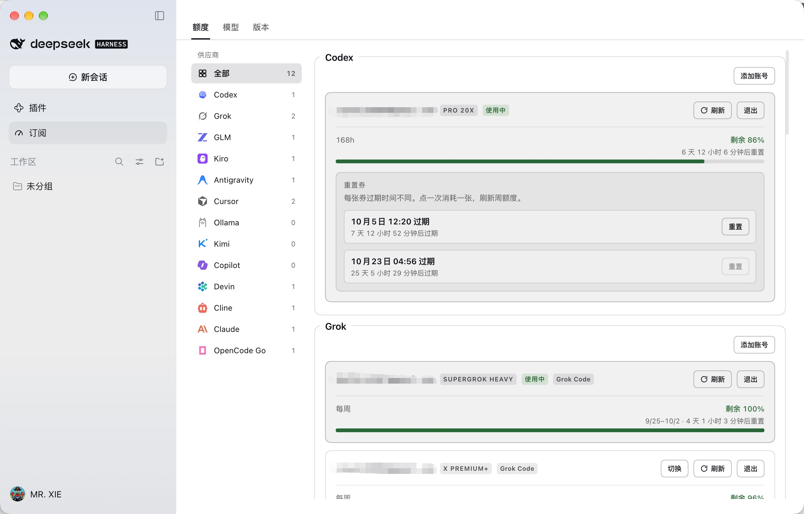
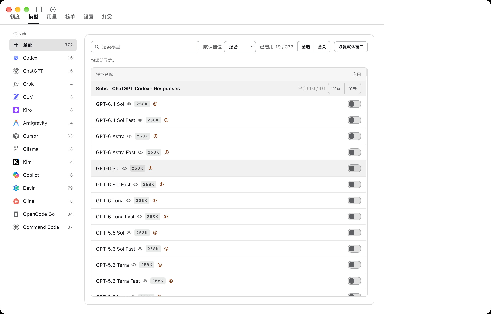
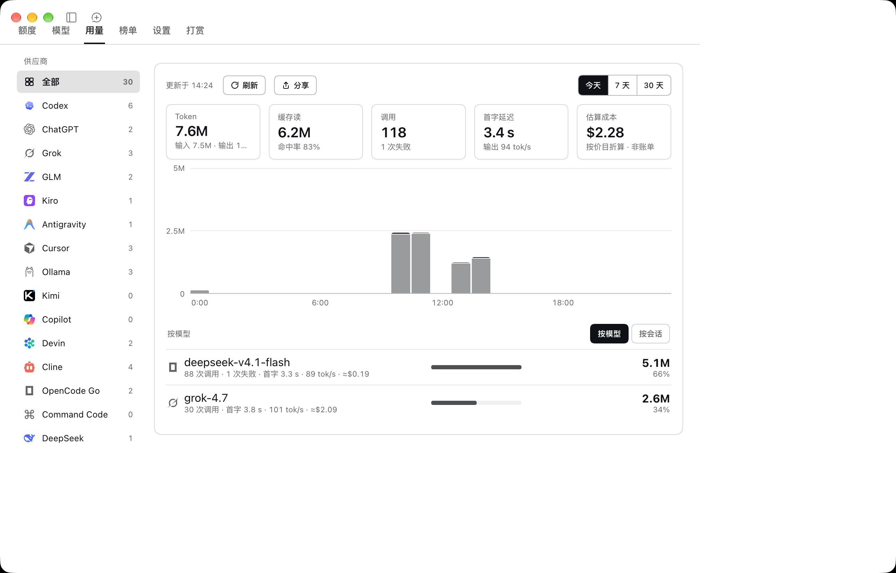
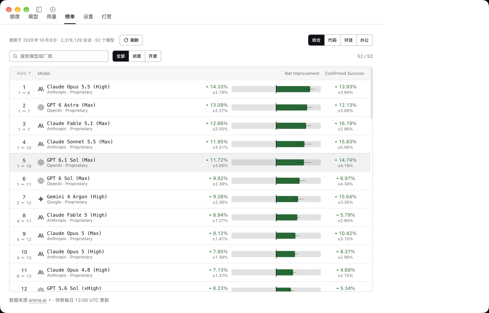
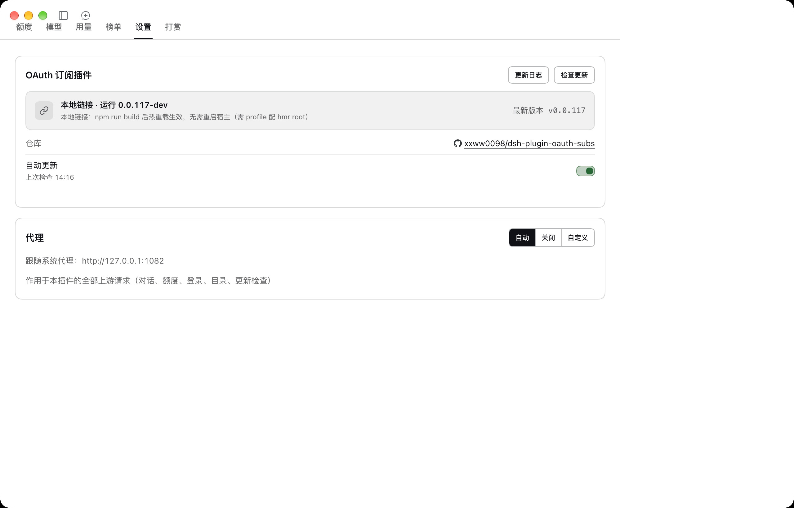

# dsh-plugin-oauth-subs

简体中文 | [English](README.md)

[](https://github.com/xxww0098/dsh-plugin-oauth-subs/actions/workflows/ci.yml)

**把你已经在付费的 AI 订阅接进 [DeepSeek Harness](https://github.com/deepseek-ai/deepseek-harness)。** 登录一次，ChatGPT / Codex、Grok、GLM、Kiro、Antigravity、Cursor、Ollama Cloud、Kimi、Copilot、Devin、Cline 的套餐就变成会话里能直接选的模型——额度、模型、用量都在一个工作台里。



<details>
<summary><b>更多页面</b> —— 模型 · 用量 · 榜单 · 设置</summary>

<br>

### 模型



### 用量



### 榜单



### 设置



</details>

## 快速开始

**1 · 安装插件**

```sh
dsh plugin --profile web add https://github.com/xxww0098/dsh-plugin-oauth-subs
dsh web
```

桌面应用请在 **插件 → 添加插件** 里粘贴同一个仓库地址，上面的命令只适用于 web。

**2 · 打开工作台**

侧边栏 → **插件** → **订阅**。

**3 · 添加账号**

选服务、登录就行。多数服务一步完成：浏览器打开、点同意、回到插件。本机已经登录过？选 **导入本机 …**，插件会直接接手你已有的登录。

**4 · 用起来**

打开 **模型** 页签，把要用的家族打开，然后在 Harness 会话的模型菜单里选它。

## 工作台

| 页签 | 作用 |
|---|---|
| **额度** | 每个账号一张卡片——套餐徽章、用量与重置进度条。约每分钟自动刷新，也可点 **刷新额度**。 |
| **模型** | 模型清单。按家族开关，并可上调单个模型的输入窗口。 |
| **用量** | Token、缓存命中、调用次数、首字延迟与估算成本，按模型或按会话查看。 |
| **榜单** | 每日更新的模型排名快照。 |
| **设置** | 更新、代理，以及插件自身的来源信息。 |

## 支持的订阅

| 服务 | 怎么登录 |
|---|---|
| **ChatGPT / Codex** | 用 ChatGPT 登录，或导入本机 Codex 登录 |
| **xAI Grok** | 设备码——在浏览器里确认 |
| **智谱 GLM** | Z.ai / BigModel 登录，或导入本机 ZCode 登录 |
| **AWS Kiro** | 社交账号 / Builder ID / IdC / Entra 登录、`ksk_` 密钥，或粘贴 JSON/CSV |
| **Google Antigravity** | Google 登录，或导入本机 Antigravity token |
| **Cursor** | 登录，或点 **导入本机 Cursor** |
| **Ollama Cloud** | 粘贴 API key |
| **Kimi Code Plan** | 设备码，或导入本机 Kimi 登录 |
| **GitHub Copilot** | 设备码，或导入本机 Copilot 登录 |
| **Devin Agent** | 登录，或导入本机 Devin 凭据 |
| **Cline** | 设备码，或导入本机 Cline 登录 |
| **Command Code** | 粘贴 API key，或导入本机登录 |
| **OpenCode Go** | 粘贴 API key——填上控制台工作区才能看到额度 |

## 使用提示

- **账号只存在你本机。** 数据都在本地 DSH profile 里，除了你登录的那家服务，不会发给任何第三方。
- **`-fast` 模型更耗额度。** 它们更快，但也更快花掉套餐——在意延迟时再用。
- **推理等级**在 Harness 会话菜单里选，不在「模型」页签。
- **更新会自动安装。** 也可以到 **设置** 页签手动检查并安装。
- **成本是估算值**，按公开价目折算，不等于账单。

## 遇到问题

| 现象 | 怎么办 |
|---|---|
| 页签里还是旧版本 | **设置 → 检查更新 → 安装更新**，然后重启 |
| 少了某个模型 | 打开 **模型** 页签，确认对应家族是打开的 |
| 额度不更新 | 点 **刷新额度**——它本身也约每分钟自动刷新一次 |
| 桌面应用一打开就退出 | 在终端执行 `launchctl unsetenv ELECTRON_RUN_AS_NODE`，再启动 |

<details>
<summary><b>进阶</b> —— 配置、家族与内部实现</summary>

<br>

### 家族与路由

| 服务 | 登录 / 导入 | DSH api |
|---|---|---|
| ChatGPT Codex | PKCE `localhost:1455`（可粘贴回调）；导入 `~/.codex/auth.json` | `openai-responses` |
| ChatGPT（Sign in with ChatGPT） | 官方应用流程走回环；ID token 经 JWKS 校验 | `openai-responses` |
| xAI Grok | 设备码（默认）或 PKCE；导入 `~/.grok/auth.json`、`~/.hermes/auth.json` | `openai-responses` |
| 智谱 GLM（Z.ai / BigModel） | ZCode CLI 登录轮询；导入 `~/.zcode/v2/config.json` | `anthropic-messages` |
| AWS Kiro | 社交 PKCE / Builder ID / IdC / Entra / `ksk_` 密钥；粘贴 JSON · kami · CSV；导入 `~/.kiro/credentials.json` | `openai-completions` |
| Google Antigravity | Google OAuth `localhost:51121`（可粘贴回调）；导入 `~/.gemini/antigravity-cli/` token | `openai-completions` |
| Cursor | PKCE，或 **导入本机 Cursor**（macOS Keychain / `state.vscdb`） | `openai-completions` |
| Ollama Cloud | 粘贴 API key / `OLLAMA_API_KEY` | `openai-completions` |
| Kimi Code Plan | 设备码；导入 `~/.kimi-code/credentials/kimi-code.json`；`KIMI_API_KEY` | `openai-completions` |
| GitHub Copilot | 设备码；导入 `~/.config/github-copilot/hosts.json`；`GITHUB_TOKEN` | `openai-completions` |
| Devin Agent | PKCE `127.0.0.1:59653`；导入 `~/.local/share/devin/credentials.toml`；粘贴 `devin-session-token$…` | `openai-completions` |
| Cline | 设备码；导入 `~/.cline/data/settings/providers.json` | `openai-completions` |
| Command Code | 粘贴 API key / `COMMAND_CODE_API_KEY` / 导入 `~/.commandcode/auth.json`；或 studio 浏览器登录 | `openai-completions` |
| OpenCode Go | 粘贴 API key（额度需可选的控制台 cookie/工作区）；直连，不走代理 | `openai-completions` / `openai-responses` |

各家族的设计、钉住的客户端版本与上游 hop：[docs/oauth.md](docs/oauth.md) 与各 `src/oauth/<id>/README.md` / `src/apikey/<id>/README.md`。

### 工作原理

| 平面 | 作用 |
|---|---|
| 订阅面板 | 登录 / 导入 / 退出，然后同步模型 |
| llm-pi-ai | DSH 调用面；把各家族路由到回环代理（OpenCode Go 直连） |
| 回环代理 | `http://127.0.0.1:8318/{codex,grok}/v1/responses`、`/glm/v1/messages`、`/<family>/v1/chat/completions` |
| 上游 | 刷新后的订阅 bearer，或当前生效的 API key |

代理只绑定回环地址，并要求 `DSH_OAUTH_SUBS_API_KEY`。面板关闭后，DSH 继续使用已配置的路由。

### 模型与额度

**模型** 页签按家族提供开关（默认全开）；行上的窗口徽标可打开对话框，在该行上限内上调输入窗口。推理等级在 Harness **会话**模型菜单里设，不在「模型」页签。上游支持处提供 `-fast` 变体（Codex Priority；Devin 后端变体）。Fast 与更大的窗口都更耗额度。

**额度** 页签为每个账号显示套餐徽章与用量 / 重置进度条（Ollama Cloud：会话 / 每周用量），约每分钟刷新一次，或点 **刷新额度**。

各家族的模型目录、effort、窗口、额度端点与费率出处：[docs/models.md](docs/models.md)、[docs/oauth.md](docs/oauth.md) 与各家族 README。

### 数据位置

凭据在 `<profile>/data/dsh-plugin-oauth-subs/auth.json`（`0600`）；OpenCode Go 账号在 `opencode-go.json`；模型选择在 `models.json`——都在该数据目录下。

### 配置项

| 配置 | 默认值 | 说明 |
|---|---|---|
| `port` | `8318` | 回环代理端口 |
| `provider` | `oauth` | llm-pi-ai 路由前缀；每个家族落在 `oauth-<id>` |
| `dataDir` | profile 数据目录 | `auth.json`、`models.json`、`proxy-key` |
| `grokLogin` | `device` | `device` 或 `pkce` |
| `proxyUrl` | settings / env | 模型 / 额度 / 登录跳转的出站 HTTP(S) 代理 |
| `cursorProxy` | — | Cursor 上游代理（`http://` 或 `socks5://`），用于区域门模型 |

### 诊断

```sh
npm run analyze -- path/to/session.jsonl              # 单个会话
npm run analyze -- --dir ~/.dsh/sessions --since 30d  # 汇总所有会话
```

健康标准：加权缓存命中 ≥ **80%**，**零 affinity miss**。调用会被标记为 `cold_start` / `delta` / `compaction` / `rebuild` / `affinity_miss`，所以压缩不会被误判成分片回归。详见 [CONTRIBUTING.md](CONTRIBUTING.md) 与 [docs/error.md](docs/error.md)。

</details>

## 参与开发

欢迎提 issue 和 PR。构建、测试与发布命令见 [CONTRIBUTING.md](CONTRIBUTING.md) 与 [docs/development.md](docs/development.md)。
